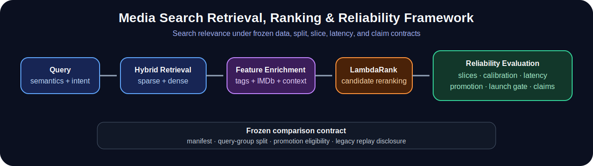

# Multimodal Media Search Reliability Framework

<!-- PUBLIC_PORTFOLIO_START -->
<p align="center">
  
</p>

<p align="center">
  <a href="https://github.com/ReviveCoding/media-search-multimodal-discovery-reliability-framework/actions/workflows/ci-final.yml">
    
  </a>
</p>

A reproducible multimodal media-search reliability framework for **query understanding, hybrid retrieval, learning-to-rank, metadata enrichment, slice-aware evaluation, calibration, latency analysis, and frozen release contracts**.

This repository is built around a practical question: **how do you improve search relevance without losing control of comparability, slice regressions, latency, or claim validity?**

## Results at a glance

| Release signal | Result |
|---|---:|
| Promoted champion | `combined_feature_only` |
| Canonical baseline | `core_champion_replay` |
| Canonical NDCG@10 | `0.312599` → `0.322034` |
| Relative NDCG@10 change | `+3.02%` |
| Regression tests | `60 passed` |
| Frozen contract | `validated` |
| Committed-HEAD clean checkout | `PASS` |
| Strict legacy replay claim | `false` |
| Launch decision | `ITERATE` |

The result is intentionally framed as a **canonical frozen-contract improvement**, not as an unconstrained comparison against every historical run.

## What makes this more than a demo notebook

- **Search-system scope:** query semantics, hybrid retrieval, ranking, enrichment, calibration, slice diagnostics, latency, and launch gates.
- **Reliability contracts:** frozen manifest and query-group split checks prevent invalid experiment comparisons.
- **Promotion discipline:** candidates must satisfy ranker lift, overall quality, and slice-regression rules.
- **Claim governance:** legacy runs remain visible but are excluded from strict replay claims when fingerprints differ.
- **Reproducibility:** the exact committed `HEAD` installs in a new environment and passes the full test and release-contract suite.

## 30-second review path

1. Read the [final results](docs/FINAL_RESULTS.md) and [claim boundaries](docs/CLAIM_BOUNDARIES.md).
2. Inspect the [system architecture](docs/ARCHITECTURE.md).
3. Run the [public demo walkthrough](docs/DEMO_WALKTHROUGH.md).
4. Review the implementation in `src/media_search_reliability/`.
5. Inspect the frozen-contract and regression tests in `tests/`.

## Quick proof

```powershell
python -m venv .venv
.\.venv\Scripts\python.exe -m pip install -e .
.\.venv\Scripts\python.exe -m pytest -q
.\.venv\Scripts\python.exe scripts\public_demo.py
```

Expected release signals:

```text
champion=combined_feature_only
canonical_baseline=core_champion_replay
canonical_contract_validated=True
strict_replay_claim=False
```

## Documentation map

- [Architecture](docs/ARCHITECTURE.md)
- [Demo walkthrough](docs/DEMO_WALKTHROUGH.md)
- [Repository map](docs/REPOSITORY_MAP.md)
- [Final results](docs/FINAL_RESULTS.md)
- [Reproducibility](docs/REPRODUCIBILITY.md)
- [Claim boundaries](docs/CLAIM_BOUNDARIES.md)
- [Public release checklist](docs/PUBLIC_RELEASE_CHECKLIST.md)

<!-- PUBLIC_PORTFOLIO_END -->

This patch fixes aggregation when legacy core profile runs were created before the canonical frozen split contract.

- Strict exact contract checks remain required for `core_champion_replay`, `tag_genome_feature_only`, `imdb_feature_only`, and `combined_feature_only`.
- Legacy `core_conservative`, `core_balanced`, and `core_compact` runs remain visible for historical profile-selection context but cannot block aggregation or champion promotion.
- Strict GPU replay is only claimed when manifest, split, and config fingerprint all match.

<!-- FINAL_RESULTS_START -->
## Final frozen benchmark result

- **Promoted champion:** `combined_feature_only`
- **Canonical baseline:** `core_champion_replay`
- **NDCG@10:** `0.312599` → `0.322034` (+3.02%)
- **Frozen contract:** validated for the canonical baseline and enrichment variants
- **Legacy replay disclosure:** `legacy_not_strictly_comparable`; no strict GPU replay claim
- **Launch decision:** `ITERATE`

See [final results](docs/FINAL_RESULTS.md), [reproducibility](docs/REPRODUCIBILITY.md), and [claim boundaries](docs/CLAIM_BOUNDARIES.md).
<!-- FINAL_RESULTS_END -->

