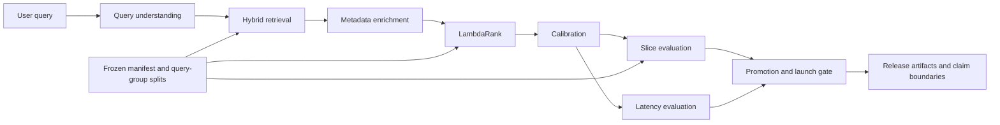

# Architecture

## Reliability layers

### Data and comparison contract

The frozen manifest and query-group split define the canonical comparison boundary. Candidate runs are not treated as directly comparable merely because they use the same dataset family.

### Retrieval and ranking

The framework combines retrieval candidates with feature enrichment and a learning-to-rank stage. Release analysis separates retriever drift from ranker improvement.

### Slice-aware evaluation

Overall ranking quality is evaluated alongside genre/tag, mood/decade, personalization, similar-to, and visual-query slices. Promotion is blocked when material slice regressions exceed the configured guardrail.

### Calibration and latency

Ranking quality is reported with calibration error and latency measurements. Latency remains diagnostic unless measured repeatedly under controlled, identical conditions.

### Promotion and claim governance

A candidate can be the best eligible frozen-contract run while still receiving an `ITERATE` launch decision. Promotion eligibility and production launch readiness are separate decisions.
